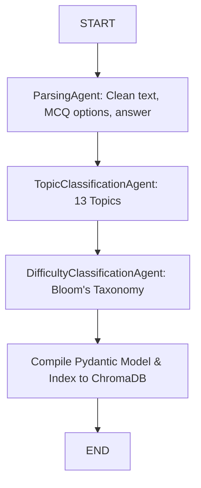

# Stats Olympiad Ingestion Studio

An end-to-end, multi-agent orchestrator built to ingest raw Word documents (.docx), structure mathematical content, and compile balanced Statistics Olympiad question paper booklets.

## 🌟 Key Features
* **Multimodal Extraction & Solving**: Automatically extracts charts, pie graphs, and complex diagrams from source documents, feeding them to vision LLMs (Qwen2.5-VL / Gemini) to resolve visual math questions.
* **Agentic Workflows**: Uses LangGraph to coordinate clean parsing, 13-topic taxonomy classification, Bloom's difficulty categorization, and ChromaDB vector indexing.
* **Balanced Paper Creator**: Shuffles and scrambles options dynamically while satisfying strict question distribution targets (Easy, Medium, Hard).
* **Word (.docx) & Markdown (.md) Exporters**: Generates beautiful print-ready student booklets and teacher solution keys, rendering math tables and centering images automatically.
* **Ingestion Studio Web UI**: A sleek, dark-mode FastAPI Single Page Application featuring drag-and-drop document uploaders, live Server-Sent Events (SSE) progress indicators, and a download center.

---

## 🛠️ Codebase Architecture

```text
├── data/
│   ├── raw/                   # Raw source .docx files (Level 1 / Level 2)
│   └── templates/             # Markdown template formats for questions
├── db/                        # Local ChromaDB Vector Database storage (git-ignored)
├── src/
│   ├── agents/
│   │   ├── data_processors.py # Prompts and logic for Ingestion, Topic, and Difficulty agents
│   │   ├── evaluator.py       # Booklet Validation Agent
│   │   ├── orchestrator.py    # Main Ingest Orchestration (LangGraph Flow)
│   │   └── paper_creator.py   # QuestionPaperCreatorAgent (scrambling & targeting)
│   ├── static/                # Single Page App frontend (index.html, style.css)
│   ├── classifier.py          # ChatGradio client, JSON escaping, and multimodal image mapping
│   ├── exporter.py            # Docx python-docx insert and Markdown booklet exporters
│   ├── indexer.py             # ChromaDB client & semantic duplicate check constraints
│   ├── parser.py              # Word docx Docling text converter & image extraction
│   └── web_server.py          # FastAPI web server serving UI, SSE progress, and downloads
├── config.env                 # API Keys and Model definitions (git-ignored)
├── generate_paper.py          # Standalone CLI entrypoint
└── requirements.txt           # Python library dependencies
```

---

## 🚀 Quick Start Guide

### 1. Installation
Clone the repository and set up a virtual environment:
```bash
git clone https://github.com/ZaheerH-03/stats-olympiad-studio.git
cd stats-olympiad-studio

# Create and activate virtual environment
python -m venv .env
source .env/bin/activate  # On Windows: .env\Scripts\activate

# Install dependencies
pip install -r requirements.txt
pip install fastapi uvicorn python-multipart
```

### 2. Configure Credentials
Create a `config.env` file in the root folder (modeled from configuration settings):
```env
LLM_PROVIDER=gemini
GEMINI_API_KEY=your_gemini_api_key
GEMINI_LLM_MODEL=models/gemini-2.5-flash
EMBEDDING_PROVIDER=local_api
```

### 3. Launch the Web Ingestion Studio
Start the local FastAPI server:
```bash
python src/web_server.py
```
Open **[http://127.0.0.1:8000](http://127.0.0.1:8000)** in your web browser to upload files, configure models, stream ingestion progress, and download booklets!

---

## 🤖 Agentic Ingestion Workflow (LangGraph)

When a question is parsed, it travels through this sequential LangGraph workflow:



---

## 📄 License
This project is licensed under the MIT License.
